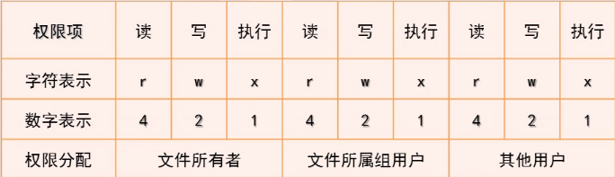

## 文件权限设置
### 文件权限概念

> drwxr-xr-x

### 文件权限设置
- 文件权限字符形式设置命令: `chmod a+x`
    - u: user     `u+r`
    - g: group    `g-r`
    - o: other        `o+x`
- 文件权限数字形式设置:  `chmod 644`
- 缺省权限设置命令: umask
    - 系统中权限掩码的设置: umask 022
### 文件属主和属组设置
- 文件属主设置命令: `chown`
    - 缺省设置当前文件的所有者用户
    - 常用选项参数 `-R`用于递归设置目录中所有文件的属主
        - eg:  `chown -R testdir`
        -      `sudo chown testuser newdir`
- 文件数组设置命令: `chgrp`
    - 缺省将当前文件的所属组变更为目标用户组
    - 常用选项参数 `-R`用于递归设置目录中所有文件的属组
        - eg : `chgrp -R testdir`
        - `sudo chgrp testgroup newdir`
- chown也可以用来同时改变属主和属组
    - `sudo chown testuser:testgroup newdir`
    - 也可以用来只改变属组   `sudo chown :testgroup newdir`