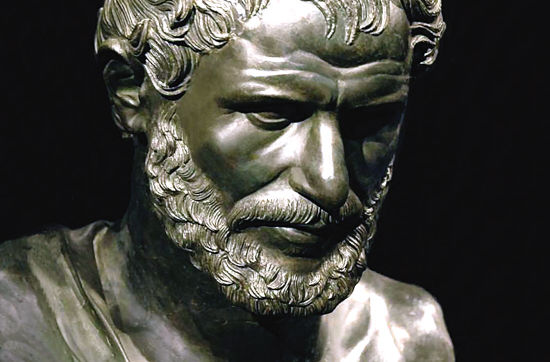

#### 泰利斯其人
泰利斯是众所公认的第一位西方哲学家,也是人称的希腊七贤之一.作为一位贤人,他的箴言"认识你自己","凡事无过度"等会被刻在阿波罗神庙的墙上.

当然,他的贡献不止于此,如果不研究哲学,我们知道他更多是从他在数学方面所做出的贡献.比如,他证明了圆被直径等分;等腰三角形两底角相等;两直线相交,对角相等;内切半圆周的三角形是直角三角形等定理;在天文学方面,他最为众人所知的便是准确预测出了公元前585年5月20日的日全食;

作为一名哲学家,泰利斯有一次夜晚走在路上,望着天上的星星陷入了沉思,不巧的是一下子掉进了一口井里,后被路过的妇女救了上来;那妇人便嘲讽泰利斯是"研究天上的星星,却看不到自己脚下的人".但事实上泰利斯本人并非完全如此.最广为流传的一个故事是,有一次泰利斯预测到下一年的橄榄会丰收,便租下了很多的榨油机.后来一切都如他所料,他也因此而大赚一笔.

作为哲学家,在务实上有如此的才华实为罕见.通常说务实者务不了虚,而务虚者也同样无法务实,这是因为虚实之间有道无法逾越的鸿沟.但泰利斯似乎是个意外.

身为爱奥尼亚学派的奠基人,泰利斯的学说在相当长一段时间里引导了整个希腊哲学的行进方向,他是历史上第一位还原主义哲学家,率先开始了对物质世界的探索,在这一点上他曾提出,万物来自水,又复归于水.这点在我们看来似乎显得可笑,但在当时的历史背景下却有着不容忽视的历史意义.

#### 万物来自水,又复归于水

在古希腊,哲学启蒙之前,对于世间所有不理解的自然现象,人们更倾向于解释为神的意志,因此就有了众神的故事.这种思潮延续了很久,直到哲学启蒙,第一位试图用自然原理来解释宇宙的人--泰利斯的出现,微弱的哲学思脉才得以生根.在当时的社会环境下,这种行为简直就是逆天.在此以前人们的观念里,众神是不可解读的,只可信奉,而泰利斯却将人们所不理解的事物一一拆解开来,并用人们所熟知的事物一一进行解释,也就是说,以前神圣难以描述的,现在都变得平常随处可见.

从此,自然神圣的一面,被降低至人类所能理解的层面.

泰利斯探索自然所采用的还原法,其终极目的是希望通过抽象大千世界的复杂现象,找到背后导致发生这一切的终极因素,似乎自然界早在微观层面对一切事物做出了决定性的决策.这一点在现代科学不断发展的过程中不断得到印证,比如动物的基因在很大程度上就决定了寿命的长短,高矮胖瘦,以及后天可能显现出的特征.而在物理学方面,现象界大多数行为又被抽象为重力,电磁力,以及将原子核聚集在一起的强核力和弱核力所作用的结果.

然而,更有甚者希望终有一天能够通过单一的因素来解释所有的现象,这就需要更进一步的抽象还原.对纯粹的哲思,务虚者而言,可能是一条值得纵深的道路.但对生活在当下的人们而言,还原法的运用可能要适可而止才行.

#### 现实界的现实问题

对我们大多数人而言,还原论更贴切的解释应该是:用已知的现象解释未知的现象.但即使是这种程度的还原,在实际操作的过程中,我们也得谨慎才行.

比如,书写在书本中的文字是用墨印刷的,但如若说一本小说是一堆墨的堆叠,便是完全忽视了小说本身的价值.

1999年美国康奈尔大学发表一份报告,说爱情其实只是一种药物成分,确切地说,它是血液里多巴胺,苯氨基丙酸和催产素共同作用的结果.如果我们对爱情的理解也仅限于这种还原,你还能坦然面对过往的一些疯狂举动吗?

当然还原法也并非总是如此,如果运用的当,对生活,对效率而言总是一种提升.

对于一辆汽车是如何行使到目的地的,正常的解释是驾驶员运用自己的娴熟的技能,驶向那里,但极端还原者的解释可能是下面这样的:

`首先踩下油门,然后汽油燃烧,分子间产生强大的撞击力,最后推动车子前往目的地.`

这种还原对大多数人而言显得非常没有必要且无聊.但是还有一种情况,如果车子在途中出了问题,导致停了下来,这时还原论者的解释可能更有说服力.

还原论对于现代一些服务业的发展也起到了非常重要,甚至决定性的作用,比如麦当劳,肯德基的广告就是你在全世界的任何一个地方都能吃到味道一样的套餐.

还原论在培养一个人全局观能力方面,也起到了很重要的作用,比如一名舰长,要想保证整个舰船的安全行使,就必须逐一排除其中可能存在的安全隐患,这其中就要运用还原法,将整个舰船系统拆分成很多个子模块,从而进行排查.对于想要掌握一门技能的个人而言,也是同样的道理.

还原论本身在不被恰当运用的情况下确实存在很多问题,但是回过头看,我们是否还能找到一个对事物解释里如此之强,又无害处的理论呢?